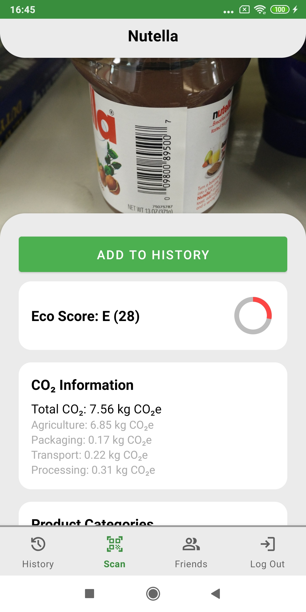
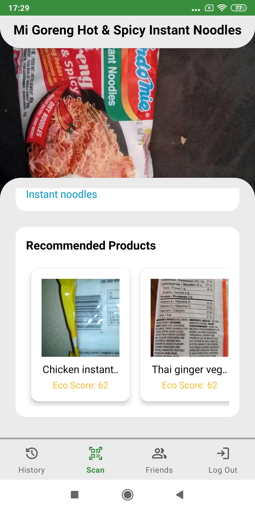
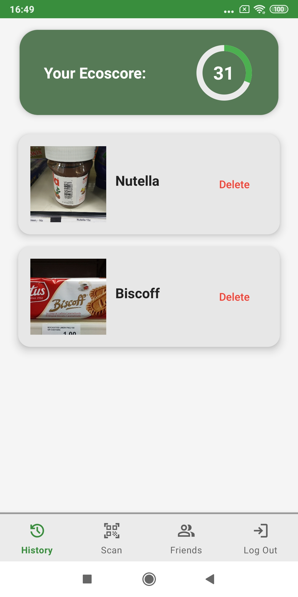
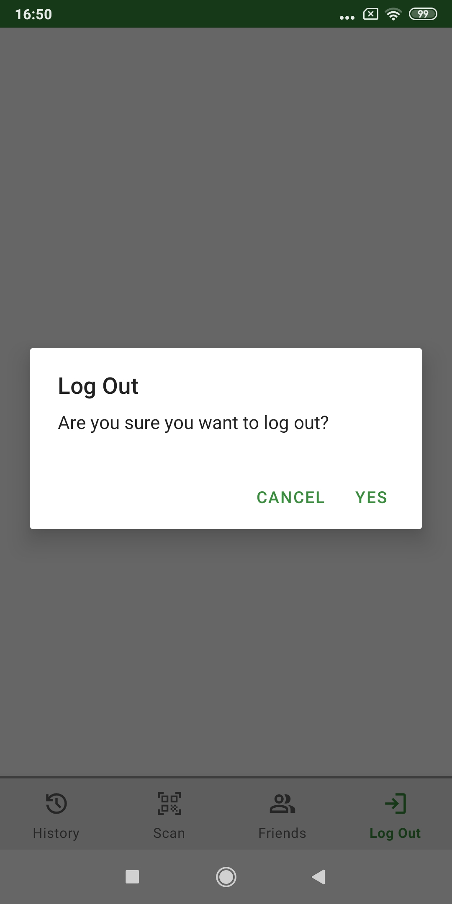
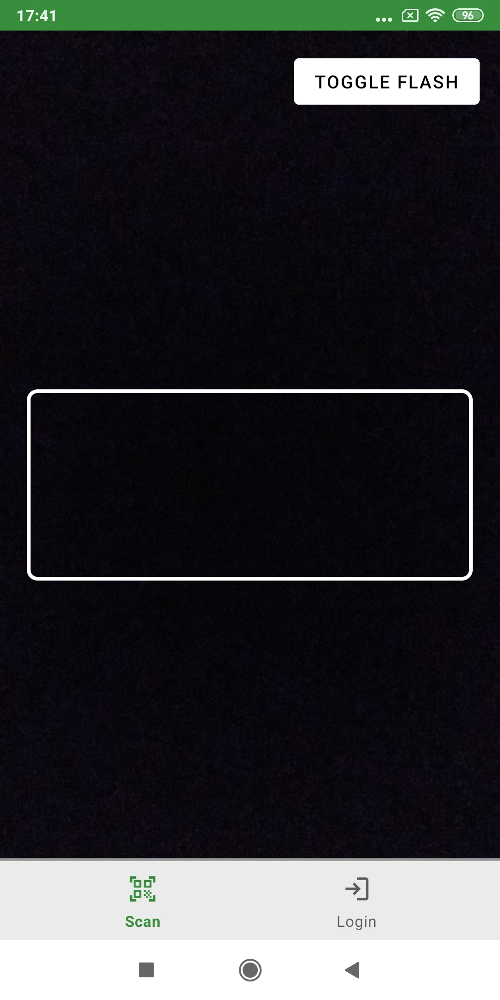
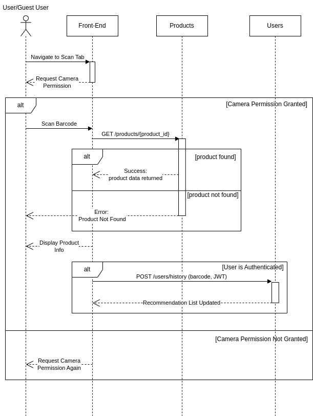
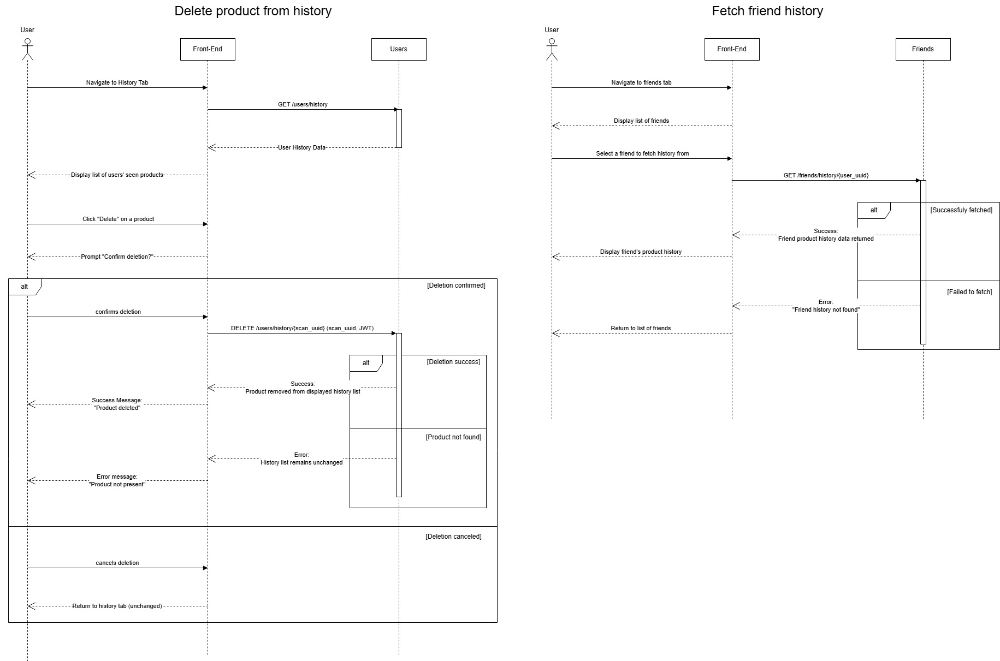
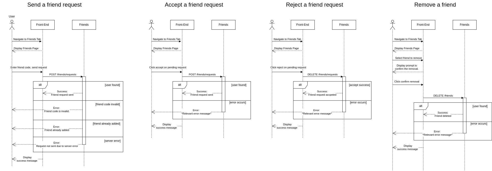

# M3 - Requirements and Design

## 1. Change History

| Date       | Modified Section(s)             | Rationale for Modification                   |
|------------|------------------------------|-----------------------------------------------|
| 2025-03-28 | 3.3 Functional Requirements - 1. Scan Products | Added step for barcode confirmation to help users avoid incorrect barcode scans. | 
| 2025-03-28 | 3.3 Functional Requirements - 1. Scan Products  | Updated step 7 as users now have the option to manually add scans to history instead of scans automatically being added. | 
| 2025-03-28 | 3.3 Functional Requirements - 3. Manage Friends - 1. Send a friend request | Updated step 1 to reflect user interaction with the add friend menu added to the friends tab. | 
| 2025-03-28 | 3.4. Screen Mockups   | Updated screen mockups to reflect the new front-end design of app. |
| 2025-03-28 | 4.1. Main Components - 1. Products | Updating the `GET /products/{product_id}` interface to include the query parameters `num_recommendations`, `include_languages`, and `include_countries` to support limiting recommendations and applying regional and language-based filtering. |
| 2025-03-28 | 4.1. Main Components - 2. Users | Removed the `timestamp` parameter from `List<History> getHistoryByUserUUID(String user_uuid, String timestamp)` as timestamp filtering is now handled on the front-end not the back-end. |
| 2025-03-28 | 4.1. Main Components - 3. Friends | Added the `GET /friends/requests/outgoing` interface to allow for users to retrieve their outgoing pending friend requests. Removing the `timestamp` parameter from `GET /friends/history`, `GET /friends/history/{user_uuid}`, and `GET /friends` as timestamp filtering is now handled on the front-end not the back-end. |
| 2025-03-28 | 4.1. Main Components - 3. Friends | Removed the `timestamp` parameter from `GET /friends/history`, `GET /friends/history/{user_uuid}`, and `GET /friends` as timestamp filtering is now handled on the front-end not the back-end. |
| 2025-03-29 | 3.4. Screen Mockups | Updated the recommendations screen mockup to better reflect the new recommendations system |

## 2. Project Description

CarbonWise empowers consumers to make more sustainable choices by providing clear and accessible information about the environmental impact of their purchases. With CarbonWise, users can simply scan a product's barcode while shopping to receive an eco-score, sustainability details, and recommendations for greener alternatives. Additionally, CarbonWise encourages accountability by allowing users to connect with friends, compare sustainability scores, and share progress, fostering a community-driven approach to responsible consumption.

## 3. Requirements Specification

### **3.1. Use-Case Diagram**


### **3.2. Actors Description**

1. **User**: A user that is authenticated and has access to all functionality.
2. **Guest User**: An unauthenticated guest user who can scan products but cannot access history or friend features.

### **3.3. Functional Requirements**
<a name="fr1"></a>

1. **Scan Products**  
     
    - **Overview**:  
       
        1. Scanning a product

    - **Detailed Flow for Each Independent Scenario**:  
       
        1. **Scanning a product**  
            - **Description**: Users and guest users can scan a product’s barcode to retrieve an eco-score, sustainability information, and product recommendations.  
            - **Primary actor(s)**: User, Guest User  
            - **Main success scenario**:  
                1. User or guest user navigates to the scan tab.  
                2. The system requests camera permissions if not previously granted.  
                3. User or guest user grants camera permissions if requested.  
                4. User or guest user scans a barcode using the device camera.  
                5. The system displays the scanned code and prompts the user for confirmation.
                6. On confirmation the system retrieves and displays an eco-score, sustainability information, and product recommendations for the scanned product.
                7. The user can choose to add the scanned product to the user’s history if the user is authenticated.
            - **Failure scenario(s)**:  
                - 3a. User or guest user denies camera permissions.  
                    - 3a1. The system returns the user or guest user to the scan tab and displays a message that camera permissions are required for scanning.
                - 4a. The barcode is unreadable due to camera quality. 
                    - 4a1. The system waits on the scan tab until it is provided with a readable barcode.  
                - 5a. The user denies confirmation.
                    - 4a1. The user is returned to the scan tab, and no product is displayed.  
                - 6a. The system is unable to retrieve information for a product because it does not exist or is missing required fields.  
                    - 5a1. The system informs the user or guest user that information for the product is not available.  
                    - 5a2. The system returns the user or guest user to the scan tab.  
                - 6b. The system is unable to retrieve product data due to a server error.
                    - 5b1. The system informs the user or guest user that product information could not be retrieved and displays the relevant server error.
                    - 5b2. The system returns the user or guest user to the scan tab.
                - 7a. The system is unable to add the scanned product to the user’s history due to a server error.  
                    - 6a1. The system informs the user that the scanned product could not be added to history and displays the relevant server error.

<a name="fr2"></a>

2. **Authenticate Guest User**  
     
    - **Overview**:

        1. Authenticate a guest user with Google OAuth

    - **Detailed Flow for Each Independent Scenario**:  
       
        1. **Authenticate a guest user with Google OAuth**  
            - **Description**: Sign in a guest user using their Google account. If an existing account is linked to the Google account, they are logged in. If no account exists, the system automatically creates an account and logs the guest user in. Once authenticated, the guest user becomes a user with full access.  
            - **Primary actor(s)**: Guest User  
            - **Main success scenario**:  
                1. Guest user navigates to the login tab.  
                2. The system prompts the guest user with the Google OAuth authentication screen.  
                3. Guest user selects a Google account and grants permission for the system to access profile details.
                4. The system verifies authentication with Google OAuth.  
                5. The system logs the guest user in, transitioning them to a user with full access.
            - **Failure scenario(s)**:  
                - 2a. An error occurs with the Google OAuth service.  
                    - 2a1. The system informs the guest user that authentication failed due to a Google OAuth service issue.  
                    - 2a2. The system returns the guest user to the login tab.  
                - 3a. The guest user declines to continue with Google OAuth.  
                    - 3a1. The system returns the guest user to the login tab.  
                - 4a. The Google OAuth token is invalid or expired.  
                    - 4a1. The system informs the guest user that their Google OAuth token has expired or is invalid.
                    - 4a2. The system returns the guest user to the login tab.
                - 4b. The system fails to transition the guest user to a user due to a server error.  
                    - 4b1. The system informs the guest user that login could not be completed due to a server error.  
                    - 4b2. The system returns the guest user to the login tab.

<a name="fr3"></a>

3. **Manage Friends**  
     
    - **Overview**:  
       
        1. Send a friend request  
        2. Accept a friend request  
        3. Reject a friend request  
        4. Remove a friend

    - **Detailed Flow for Each Independent Scenario**:  
       
        1. **Send a friend request**  
            - **Description**: Users can send a friend request by entering a friend's unique friend code.  
            - **Primary actor(s)**: User  
            - **Main success scenario**:  
                1. User navigates to the friends tab, and opens the add friends menu.  
                2. User enters the friend’s unique friend code and sends the friend request.  
                3. The system updates the recipient's list of incoming friend requests.
                4. The system sends a friend request notification to the recipient.  
                5. The system informs the user the friend request was successfully sent.

            - **Failure scenario(s)**:  
                - 3a. The entered friend code does not match any existing user.  
                    - 3a1. The system informs the user that the friend code is invalid.  
                - 3b. The friend code belongs to a user who is already a friend.  
                    - 3b1. The system informs the user that the friend has already been added.
                - 3c. The user already has a pending friend request sent to the recipient.  
                    - 3c1. The system informs the user that there is already a pending friend request.
                - 3d. The user is trying to send a friend request to themselves.  
                    - 3d1. The system informs the user that they cannot send a friend request to themselves.
                - 3e. The friend request could not be sent due to a server error.  
                    - 3e1. The system informs the user that the request could not be sent and displays the relevant server error.
                - 4a. The system fails to send a friend request notification as the recipient does not have notifications enabled.
                    - 4a1. The system continues the friend request sending process without sending a notification.

        2. **Accept a friend request**  
            - **Description**: Users can accept incoming friend requests to add friends to their friend list.  
            - **Primary actor(s)**: User  
            - **Main success scenario**:  
                1. User navigates to the friends tab.  
                2. User views pending friend requests.  
                3. User selects a pending request and accepts it.  
                4. The system updates both users' friend lists.  
                5. The system sends a notification to the user that sent the request that the friend request has been accepted.
            - **Failure scenario(s)**:  
                - 3a. The friend request is no longer valid.  
                    - 3a1. The system informs the user that the request is no longer valid.  
                    - 3a2. The system refreshes the friends tab.
                - 3b. The friend request could not be accepted due to a server error.  
                    - 3b1. The system informs the user that the friend request was not accepted and displays the relevant server error.
                - 3c. The user is trying to accept a friend request from themselves.  
                    - 3c1. The system informs the user that they cannot accept a friend request from themselves.
                - 5a. The system fails to send a notification to the user that sent the request as they do not have notifications enabled.
                    - 5a1. The system continues the friend request accepting process without sending a notification.

        3. **Reject a friend request**  
            - **Description**: Users can decline incoming friend requests.  
            - **Primary actor(s)**: User  
            - **Main success scenario**:  
                1. User navigates to the friends tab.  
                2. User views pending friend requests.  
                3. User selects a pending request and rejects it.  
                4. The system removes the pending request.  
                5. The system informs the user that the request has been rejected.
            - **Failure scenario(s)**:  
                - 4a. The friend request is no longer valid. 
                    - 4a1. The system informs the user that the request is no longer valid.
                    - 4a2. The system refreshes the friends tab.
                - 4b. The friend request could not be rejected due to a server error.  
                    - 4b1. The system informs the user that the friend request was not rejected and displays the relevant server error. 

        4. **Remove a friend**  
            - **Description**: Users can remove a friend from their friends list.  
            - **Primary actor(s)**: User  
            - **Main success scenario**:  
                1. User navigates to the friends tab.  
                2. User selects a friend from their list to remove.  
                3. The system prompts the user to confirm the removal.  
                4. User confirms the removal.  
                5. The system removes the friend from both users’ friend lists.  
                6. The system informs the user that the friend has been removed.
            - **Failure scenario(s)**:
                - 4a. User does not confirm the removal of the friend.
                    - 4a1. The system returns the user to the friends tab.
                - 5a. The user is not friends with the selected friend, the friend has already been removed, or the friend no longer exists.  
                    - 5a1. The system informs the user that the friend has already been removed.  
                - 5b. The friend could not be removed due to a server error.  
                    - 5b1. The system informs the user that the friend was not removed and displays the relevant server error.

<a name="fr4"></a>

4. **React to a Friend**  
     
    - **Overview**:  
       
        1. React to a friend’s product

    - **Detailed Flow for Each Independent Scenario**:

        1. **React to a friend’s product**  
            - **Description**: Users can select a friend, choose a product from that friend's history, and send a predefined reaction (e.g., "shame" or "praise"). The system sends a notification to the selected friend with the chosen reaction.  
            - **Primary actor(s)**: User  
            - **Main success scenario**:  
                1. User navigates to the friends tab.  
                2. User selects a friend from their friend list.  
                3. User views their friend's product history.  
                4. User selects a predefined reaction to a product in the selected friend's history.  
                5. The system sends a notification to the selected friend with the chosen reaction and associated product details.  
                6. The system informs the user that the reaction has been sent successfully.

            - **Failure scenario(s)**:  
                - 5a. The selected product is no longer available in the friend’s history.  
                    - 5a1. The system informs the user that the product is not part of their friend’s product history.  
                    - 5a2. The system refreshes the friend’s product history.  
                - 5b. The selected friend is no longer a friend.  
                    - 5b1. The system informs the user that the selected friend is no longer their friend.  
                    - 5b2. The system returns the user to the friends tab and refreshes their friend list.
                - 5c. The system fails to send the reaction due to a server error.  
                    - 5c1. The system informs the user that the reaction could not be sent due to a server error and displays the relevant error message.

<a name="fr5"></a>

5. **Manage Product History**  
     
    - **Overview**:

        1. Delete product from history
        2. Fetch friend history

    - **Detailed Flow for Each Independent Scenario**:  
       
        1. **Delete product from history**  
            - **Description**:  Users can delete a product from their history.  
            - **Primary actor(s)**: User  
            - **Main success scenario**:  
                1. User navigates to the history tab.  
                2. User presses the delete button for a product in their history.  
                3. The system prompts the user to confirm the deletion.  
                4. User confirms the deletion.  
                5. The system removes the selected product from the user’s history.  
                6. The system informs the user that the product has been successfully deleted.
            - **Failure scenario(s)**:  
                - 4a. User does not confirm the deletion.  
                    - 4a1. The system cancels the deletion process and returns the user to the history tab.  
                - 5a. The selected product does not exist in the user’s history.  
                    - 5a1. The system informs the user that the product is not present in their history.  
                    - 5a2. The system refreshes the history tab.  
                - 5b. The system fails to delete the product due to a server error.  
                    - 5b1. The system informs the user that the product could not be deleted due to a server error and displays the relevant error message.

        2. **Fetch friend history**  
            - **Description**:  Users can fetch and view the product history of their friends.  
            - **Primary actor(s)**: User  
            - **Main success scenario**:  
                1. User navigates to the friends tab.  
                2. User selects a friend from their friends list.
                3. The system fetches and displays the selected friend’s product history.
                4. The user can browse through the friend’s product history.
            - **Failure scenario(s)**:
                - 3a. The system fails to fetch the friend’s product history due to a server error.  
                    - 3a1. The system informs the user that the friend’s product history could not be fetched due to a server error and displays the relevant error message.
                    - 3a2. The system returns the user to the friends tab.
                - 3b. The selected friend is no longer a friend.
                    - 3b1. The system informs the user that the selected friend is no longer a friend.
                    - 3b2. The system returns the user to the friends tab.

### **3.4. Screen Mockups**

<p align="center">
  
  
  
  
  
  
</p>


### **3.5. Non-Functional Requirements**

<a name="nfr1"></a>

1. **Product Database Size**  
   - **Description**: The app should be able to recognize and retrieve eco-scores for at least 100,000 distinct products.  
   - **Justification**: A large product database is essential for providing users with accurate eco-scores and sustainability information for scanned products. Additionally, it enhances the quality of product recommendations by enabling comparisons across a broader range of products with eco-scores.  

<a name="nfr2"></a>

2. **Product Information Response Time**  
   - **Description**: Product details, including eco-scores, sustainability information, and recommendations, should be displayed within five seconds of scanning.
   - **Justification**: Quick retrieval of product information is important to allow users to make informed purchase decisions in real time and provide recommendations for more eco-friendly products.

## 4. Designs Specification	

### **4.1. Main Components**

1. **Products**  
    - **Purpose**: The products component is responsible for managing product data, including retrieval, storage, and recommendation generation based on eco-scores and categories. It integrates with MongoDB for caching and the OpenFoodFacts API for missing product details.   
    - **Interfaces**:   
        1. **`Product fetchProductById(String product_id)`**  
            - **Purpose:** Retrieves product details and recommendations from the products database for a product with the specified ID. If the product is not found in the product database, the server queries the OpenFoodFacts API, updates the product database with the retrieved information, and returns the result.  
            - **Parameters:**  
                - `product_id` (String): The barcode of the product  
            - **Returns:**   
                - The retrieved product data or an error if not found.  
        2. **`String fetchProductImageById(String product_id)`**  
            - **Purpose:** Fetches a product image from the OpenFoodFacts API given a product identifier.  
            - **Parameters:**  
                - `product_id` (String): The barcode of the product.  
            - **Returns:**   
                - A base64-encoded version of the product image or an error if not found.  
        3. **`Pair<String, int> fetchEcoscoresByProductId(product_id: string)`**  
            - **Purpose:** Retrieves a product’s eco-score and eco-grade.   
            - **Parameters:**  
                - `product_id` (String): The barcode of the product.  
            - **Returns:**   
                - The eco-score and eco-grade on success, or an error message on failure.
        4. **`GET /products/{product_id}`**  
            - **Purpose:** Retrieves a product’s eco-score, sustainability information, image, and recommendations.   
            - **Parameters:**  
                - `product_id` (String): The barcode of the product. 
                - `num_recommendations` (number): The maximum number of recommendations to return.
                - `include_languages` (String, comma-seperated): A list of languages for which each recommended product must have its product name language in this list.
                - `include_countries` (String, comma-seperated): A list of countries for which each recommended product must have a country tag in this list.
            - **Returns:**   
                - Product information, recommendations, and base64-encoded images on success, or an error message on failure.

2. **Users**  
    - **Purpose**: The Users component manages user authentication, Firebase Cloud Messaging (FCM) registration tokens, and product history tracking.
    - **Interfaces**:   
        1. **`List<History> getHistoryByUserUUID(String user_uuid)`**  
            - **Purpose:** Retrieves a user’s product history entries based on their UUID.
            - **Parameters:**  
                - `user_uuid` (String): The UUID of the user whose history is being retrieved.
            - **Returns:**   
                - A list of product history entries that match the given criteria.  
        2. **`POST /auth/google`**  
            - **Purpose:** Authenticates users via Google OAuth by exchanging a Google ID token for a JWT.  
            - **Parameters:**  
                - `google_id_token` (String): The Google ID token provided by the client after authentication.  
            - **Returns:**   
                - A JWT token containing user details on success, an error message on failure.  
        3. **`POST /users/history`**  
            - **Purpose:** Add a scanned product to a user’s history.  
            - **Requires:** 
                - `token` (String): The JWT returned by the Google authentication endpoint for verifying user identity.   
            - **Parameters:**  
                - `product_id` (String): The barcode of the product.  
            - **Returns:**   
                - The unique identifier of the added product in the user’s history.  
        4. **`GET /users/history`**  
            - **Purpose:** Retrieves a user’s product history.  
            - **Requires:** 
                - `token` (String): The JWT returned by the Google authentication endpoint for verifying user identity.  
            - **Returns:**   
                - Product details, scan timestamps, and scan unique identifiers on success; an error message on failure.  
        5. **`DELETE /users/history`**  
            - **Purpose:** Removes a scanned product from a user’s history.  
            - **Requires:** 
                - `token` (String): The JWT returned by the Google authentication endpoint for verifying user identity.  
            - **Parameters:**  
                - `scan_uuid` (String): The unique identifier of the scan entry to be removed.  
            - **Returns:**    
                - Confirmation message or an error response.  
        6. **`GET /users/uuid`**  
            - **Purpose:** Retrieves the UUID of the authenticated user, enabling other users to send friend requests.  
            - **Requires:**  
                - `token` (String): The JWT returned by the Google authentication endpoint for verifying user identity.  
            - **Returns:**   
                - The authenticated user's UUID on success, an error response on failure.  
        7. **`GET /users/ecoscore_score`**  
            - **Purpose:** Retrieves the average eco-score of the user's recent products.  
            - **Requires:**  
                - `token` (String): The JWT returned by the Google authentication endpoint for verifying user identity.  
            - **Returns:**
                - The average eco-score of the user's recent products on success, or an error response on failure.
        8. **`POST /users/fcm_registration_token`**  
            - **Purpose:** Updates the Firebase Cloud Messaging (FCM) registration token for push notifications.  
            - **Requires:**     
                - `token` (String): The JWT returned by the Google authentication endpoint for verifying user identity.  
            - **Parameters:**  
                - `fcm_registration_token` (String): The new FCM registration token.  
            - **Returns:**   
                - Confirmation message or an error response.

3. **Friends**  
   - **Purpose**: The Friends component allows users to manage their friends within the system. It enables sending, accepting, and rejecting friend requests, viewing friends' product histories, removing friends, and sending product reaction notifications.  
    - **Interfaces**:   
        1. **`POST /friends/requests`**  
            - **Purpose:** Sends a friend request to another user.  
            - **Requires:**     
                - `token` (String): The JWT returned by the Google authentication endpoint for verifying user identity.  
            - **Parameters:**  
                - `user_uuid` (String): The UUID of the user to send a friend request to.  
            - **Returns:**   
                - Confirmation message or an error response.  
        2. **`POST /friends/requests/accept`**  
            - **Purpose:** Accepts an incoming friend request.  
            - **Requires:**     
                - `token` (String): The JWT returned by the Google authentication endpoint for verifying user identity.  
            - **Parameters:**  
                - `user_uuid` (String): The UUID of the user whose friend request is being accepted.  
            - **Returns:**   
                - Confirmation message or an error response.  
        3. **`DELETE /friends`**  
            - **Purpose:** Removes a friend from the user's friend list.  
            - **Requires:**     
                - `token` (String): The JWT returned by the Google authentication endpoint for verifying user identity.  
            - **Parameters:**  
                - `user_uuid` (String): The UUID of the friend to be removed.  
            - **Returns:**   
                - Confirmation message or an error response.  
        4. **`DELETE /friends/requests`**  
            - **Purpose:** Rejects a pending friend request.  
            - **Requires:**     
                - `token` (String): The JWT returned by the Google authentication endpoint for verifying user identity.  
            - **Parameters:**  
                - `user_uuid` (String): The UUID of the user whose request is being rejected.  
            - **Returns:**   
                - Confirmation message or an error response.  
        5. **`GET /friends/requests`**  
            - **Purpose:** Retrieves a user's incoming pending friend requests.  
            - **Requires:**     
                - `token` (String): The JWT returned by the Google authentication endpoint for verifying user identity.  
            - **Returns:**      
                - A list of incoming pending friend requests on success, or an error message on failure.  
        6. **`GET /friends/history`**  
            - **Purpose:** Retrieves product history for all friends.  
            - **Requires:**     
                - `token` (String): The JWT returned by the Google authentication endpoint for verifying user identity.  
            - **Returns:**   
                - Friends product histories and product details on success, or an error message on failure.  
        7. **`GET /friends/history/{user_uuid}`**  
            - **Purpose:** Retrieves product history for a specific friend.  
            - **Requires:**     
                - `token` (String): The JWT returned by the Google authentication endpoint for verifying user identity.  
            - **Parameters:**  
                - `user_uuid` (String): The UUID of the friend whose history is being retrieved.  
            - **Returns:**   
                - Friend product history and product details on success, or an error message on failure.  
        8. **`GET /friends`**  
            - **Purpose:** Retrieves the list of current friends.  
            - **Requires:**     
                - `token` (String): The JWT returned by the Google authentication endpoint for verifying user identity.  
            - **Parameters:**  
                - `user_uuid` (String): The UUID of the friend whose history is being retrieved.   
            - **Returns:**   
                - List of a user’s friends including their names and user unique identifiers.  
        9. **`POST /friends/notifications`**  
            - **Purpose:** Sends a Firebase Cloud Messaging (FCM) notification to a friend about a product.  
            - **Requires:**     
                - `token` (String): The JWT returned by the Google authentication endpoint for verifying user identity.  
            - **Parameters:**  
                - `user_uuid` (String): The UUID of the friend to notify.  
                - `scan_uuid` (String): The unique identifier of the scanned product in history.  
                - `message_type` (String): Either "praise" or "shame".  
            - **Returns:**   
                - Confirmation message or an error response.
        10. **`GET /friends/ecoscore_score/{user_uuid}`**  
            - **Purpose:** Retrieves the average ecoscore of a friend's past scanned products. 
            - **Requires:**     
                - `token` (String): The JWT returned by the Google authentication endpoint for verifying user identity.  
            - **Parameters:**  
                - `user_uuid` (String): The UUID of the friend whose average ecoscore is being retrieved.
            - **Returns:**   
                - The friend's average ecoscore or an error response.
        11. **`GET /friends/requests/outgoing`**  
            - **Purpose:** Retrieves a user's outgoing pending friend requests.  
            - **Requires:**     
                - `token` (String): The JWT returned by the Google authentication endpoint for verifying user identity.  
            - **Returns:**      
                - A list of outgoing pending friend requests on success, or an error message on failure.

### **4.2. Databases**

1. **User Database (MongoDB)**  
    - **Purpose:** Stores user information, authentication details, and friend connections, manages user product history, and Firebase Cloud Messaging (FCM) registration tokens.
    - Collections:  
        - **`users`** – Contains user profiles, authentication credentials, and FCM tokens.  
        - **`history`** – Stores scanned product IDs and timestamps for each user.  
        - **`friends`** – Tracks friend relationships, incoming friend requests, and user interactions.  
2. **Product Database (MongoDB)**  
    - **Purpose:** Stores product data, including eco-scores and sustainability insights. It integrates with the OpenFoodFacts API to fetch missing product information. Recommendations are done on this database, but it does not store recommendations.
    - Collections:  
        - **`products`** – Stores product details such as names, categories, eco-scores, and images.

### **4.3. External Modules**

1. **Open Food Facts API**  
   - **Purpose**: Provides access to product information, including eco-scores and sustainability data, through barcode-based lookups. The Open Food Facts API offers a MongoDB data dump for initial database population and is then queried dynamically to ensure products are up-to-date in our MongoDB database.
2. **Google OAuth API**  
    - **Purpose**: Enables authentication by validating user identities with Google ID tokens. These tokens are exchanged for JWTs that contain a unique identifier for the user in the users database allowing the system to verify their identity and authenticate them.

### **4.4. Frameworks**

1. **Express.js**
    - **Purpose:** Serves as the backend framework for handling API requests, routing, and middleware integration.  
    - **Reason:** Lightweight and efficient, making it ideal for building scalable RESTful APIs with minimal overhead.  
2. **AWS Elastic Compute Cloud (EC2)**  
   - **Purpose**: Hosts the backend server and provides scalable compute power for handling API requests and data processing.  
   - **Reason**:  EC2 allows dynamic scaling to handle varying workloads efficiently, ensuring availability and responsiveness. The EC2 instance can be scaled up during computationally intensive operations such as MongoDB indexing and database population, then scaled down to reduce costs.  
3. **ML Kit**  
   - **Purpose:** Enables barcode scanning functionality to extract product information from scanned images.  
   - **Reason:** Provides fast and accurate barcode recognition on Android with support for Kotlin.  
4. **Firebase Messaging Client (FCM)**  
   - **Purpose:** Facilitates real-time push notifications for friend interactions.  
   - **Reason:** Enables sending notifications to Android devices allowing for alerts about friend activity.

### **4.5. Dependencies Diagram**


### **4.6. Functional Requirements Sequence Diagram**

1. [**Scan Product**](#fr1)\

2. [**Authenticate User**](#fr2)\

3. [**Manage Product History**](#fr3)\

5. [**React to a Friend**](#fr4)\
  
6. [**Manage Friends**](#fr5)\


### **4.7. Non-Functional Requirements Design**

1. [**Product Database Size**](#nfr1)
   - **Validation:** The app will maintain a large product catalog by integrating the Open Food Facts MongoDB dump for initial population and querying the OpenFoodFacts API for updates. Testing will verify that at least 100,000 products fit the criteria and have all required eco-scores and sustainability information.  
2. [**Product Information Response Time**](#nfr2)
   - **Validation:** The backend will use MongoDB indexing to speed up database retrievals and optimize product queries for recommendations. Testing will measure the time taken to retrieve and display product details after scanning, ensuring responses are consistently delivered within five seconds under normal network conditions.

### **4.8. Main Project Complexity Design**

1. **Product Recommendation Algorithm**
    - **Description**: Our recommendation algorithm suggests sustainable alternatives when a user scans a product. It identifies similar products and ranks them based on their eco-scores while considering user preferences such as language and country.  
    - **Why complex?**: The challenge lies in defining product similarity, as products may differ in characteristics, branding, or ingredients but serve the same purpose. Additionally, the system must prioritize eco-friendly choices while ensuring performance remains fast enough for real-time recommendations despite a database of hundreds of thousands of products.  
    - **Design**:  
        - **Input**: A product ID (barcode number).  
        - **Output**: A ranked list of recommended products and their information.  
    - **Main computational logic**:  
        1. Identify potential alternatives by selecting products with similar properties.  
        2. Filter by region and language preferences.  
        3. Compute similarity scores based on shared attributes.  
        4. Balance eco-scores and similarity ranking to prioritize environmentally friendly choices.  
        5. Dynamically adjust search criteria if the initial query returns too few or too many results.  
        6. Return the best-ranked alternatives.  
    - **Pseudo-code**:
        ```
        function getRecommendations(product_id, filters):  

            # Fetch the original product from the database
            product = fetchProductById(product_id)  
            if not valid_product(product):  
                return error # Return an error if the product does not exist or is invalid
            
            candidates = []  
            search_features = extractFeatures(product)  
            
            # While we have not found enough candidates to make recommendations, continue searching
            while search_features not empty:  
                results = queryDatabase(product_id, search_features)  
                filtered_results = filterResults(results, filters)  
                
                for each result in filtered_results:  
                    similarity = calculateSimilarity(product, result)  
                    if similarity exceeds threshold:  
                        candidates.append(result)  
                
                # If we have found enough candidates, stop the search
                if length(candidates) >= min_required_results:  
                    break  
                
                # Loosen the search parameters to find more products
                refineSearch(search_features)  
            
            # Rank the candidates based on their eco-scores
            recommendations = []  
            for candidate in candidates:  
                score = computeFinalScore(candidate, product)  
                recommendations.append((candidate, score))  
            
            recommendations.sortByScore()   
            
            return recommendations  
        ```

## 5. Contributions

- Jason: Helped develop the front-end components like Friends and Scan, debugging problems, as well as making adjustments to the overall layout and look. I also worked on sequence diagrams and documentation. Worked for ~30 hours in total.
- Ethan: Worked on developing the product recommendation system and friends system on the back-end. Built the EC2 deployment pipeline and helped write documentation and reflection. Worked for ~55 hours in total.
- Lemon: Worked on developing front-end components, namely the history, auth, and scanning systems. Also assisted in writing documentation and reflection. Worked for ~50 hours in total.
- Xavier: Worked on the backend to set up and build the authentication system and user database for secure user management. Contributed to writing documentation, sequence diagrams, and code reviews. Worked for ~30 hours in total.
