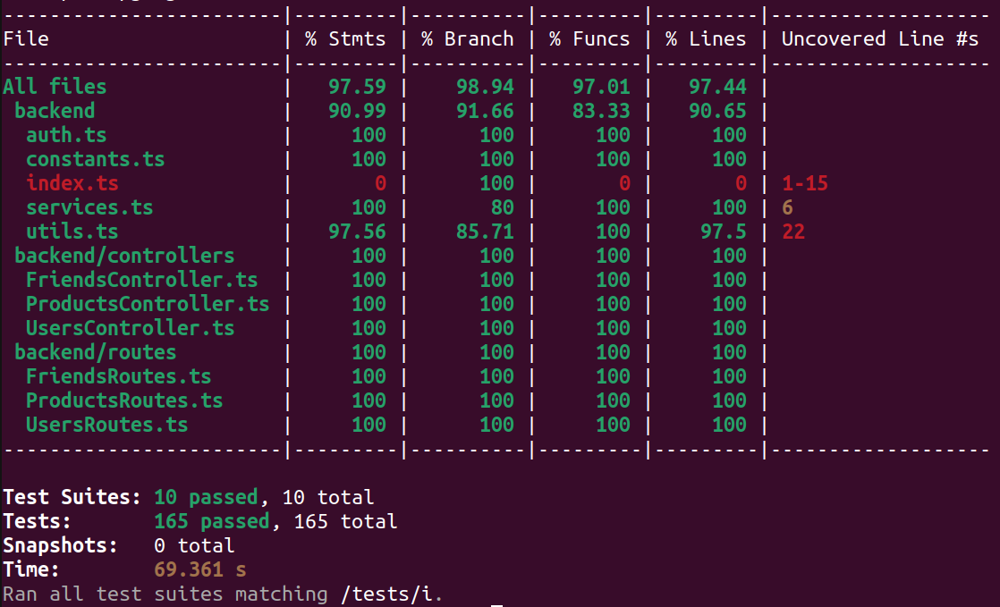

# M5: Testing and Code Review

## 1. Change History

| **Change Date** | **Modified Sections** | **Rationale** |
| -------------- | --------------------- | ------------- |
| _Nothing to show_ |

---

## 2. Back-end Test Specification: APIs

### 2.1. Locations of Back-end Tests and Instructions to Run Them

#### 2.1.1. Tests

| **Interface**                                   | **Describe Group Location, No Mocks**                 | **Describe Group Location, With Mocks**            | **Mocked Components**                                 |
| ---------------------------------------------- | ----------------------------------------------------- | ------------------------------------------------- | ------------------------------------------------------  |
| **POST /users/history**                        | [`tests/unmocked/users.test.ts#L1`](#)                | [`tests/mocked/users.test.ts#L1`](#)               | Users Database                                         |
| **GET /users/history**                         | [`tests/unmocked/users.test.ts#L1`](#)                | [`tests/mocked/users.test.ts#L1`](#)               | Users Database                                         |
| **DELETE /users/history**                      | [`tests/unmocked/users.test.ts#L1`](#)                | [`tests/mocked/users.test.ts#L1`](#)               | Users Database                                         |
| **GET /users/uuid**                            | [`tests/unmocked/users.test.ts#L1`](#)                | [`tests/mocked/users.test.ts#L1`](#)               | Users Database                                         |
| **GET /users/ecoscore_score**                  | [`tests/unmocked/users.test.ts#L1`](#)                | [`tests/mocked/users.test.ts#L1`](#)               | Users Database                                         |
| **POST /users/fcm_registration_token**         | [`tests/unmocked/users.test.ts#L1`](#)                | [`tests/mocked/users.test.ts#L1`](#)               | Users Database                                         |
| **POST /friends/requests**                     | [`tests/unmocked/friends.test.ts#L1`](#)              | [`tests/mocked/friends.test.ts#L1`](#)             | Users Database, Firebase Cloud Messaging               |
| **POST /friends/requests/accept**              | [`tests/unmocked/friends.test.ts#L1`](#)              | [`tests/mocked/friends.test.ts#L1`](#)             | Users Database, Firebase Cloud Messaging               |
| **DELETE /friends**                            | [`tests/unmocked/friends.test.ts#L1`](#)              | [`tests/mocked/friends.test.ts#L1`](#)             | Users Database                                         |
| **DELETE /friends/requests**                   | [`tests/unmocked/friends.test.ts#L1`](#)              | [`tests/mocked/friends.test.ts#L1`](#)             | Users Database                                         |
| **GET /friends/requests**                      | [`tests/unmocked/friends.test.ts#L1`](#)              | [`tests/mocked/friends.test.ts#L1`](#)             | Users Database                                         |
| **GET /friends/requests/outgoing**             | [`tests/unmocked/friends.test.ts#L1`](#)              | [`tests/mocked/friends.test.ts#L1`](#)             | Users Database                                         |
| **GET /friends**                               | [`tests/unmocked/friends.test.ts#L1`](#)              | [`tests/mocked/friends.test.ts#L1`](#)             | Users Database                                         |
| **POST /friends/notifications**                | [`tests/unmocked/friends.test.ts#L1`](#)              | [`tests/mocked/friends.test.ts#L1`](#)             | Users Database, Firebase Cloud Messaging               |
| **GET /friends/ecoscore_score/:user_uuid**     | [`tests/unmocked/friends.test.ts#L1`](#)              | [`tests/mocked/friends.test.ts#L1`](#)             | Users Database                                         |
| **GET /friends/history/:user_uuid**            | [`tests/unmocked/friends.test.ts#L1`](#)              | [`tests/mocked/friends.test.ts#L1`](#)             | Users Database                                         |
| **GET /products/:product_id**                  | [`tests/unmocked/products.test.ts#L1`](#)             | [`tests/mocked/products.test.ts#L1`](#)            | Product Database, OpenFoodFacts API                    |
| **POST /auth/google**                          | [`tests/unmocked/auth.test.ts#L1`](#)                 | [`tests/mocked/auth.test.ts#L1`](#)                | Users Database, Google OAuth                           |

#### 2.1.2. Commit Hash Where Tests Run

`[Insert Commit SHA here]`

#### 2.1.3. Explanation on How to Run the Tests

1. **Clone the Repository**:

   - Open your terminal and run:
     ```
     git clone https://github.com/ethschan/cpen321-JELX.git
     ```

    - Navigate to the backend directory:
     ```
     cd backend
     ```

   - Install dependencies:
     ```
     npm install
     ```

2. **Set Up and Build MongoDB Container**:

   - Start and build the MongoDB container with Docker Compose:
     ```
     docker-compose up -d --build mongo
     ```

3. **Download and Restore OpenFoodFacts API Database**:

   - Download the MongoDB dump:
     ```
     wget https://cpen321-jelx.s3.us-west-2.amazonaws.com/products_db.archive
     ```

   - Copy the MongoDB dump to the Docker container:
     ```
     docker cp products_db.archive mongo_instance:/products_db.archive
     ```

   - Restore the OpenFoodFacts database in the MongoDB container:
     ```
     docker exec -it mongo_instance mongorestore --db products_db --archive=./products_db.archive --gzip --drop
     ```

4. **Run the Tests**:

  - Run the tests with mocks:
     ```
     npm run test:mocked
     ```

   - Run the tests without mocks:
     ```
     npm run test:unmocked
     ```

   - Run non-functional tests:
     ```
     npm run test:non-functional
     ```

   - Run all the tests:
     ```
     npm test
     ```

5. **Pull Down MongoDB Container**:

   - Stop the MongoDB container:
     ```
     docker-compose down
     ```

   - Remove the MongoDB container (optional, to free up disk space):
     ```
     docker rm mongo_instance
     ```

### 2.2. GitHub Actions Configuration Location

`~/.github/workflows/deploy-and-test.yml`

### 2.3. Jest Coverage Report Screenshots With Mocks



### 2.4. Jest Coverage Report Screenshots Without Mocks


---

## 3. Back-end Test Specification: Tests of Non-Functional Requirements

### 3.1. Test Locations in Git

| **Non-Functional Requirement**         | **Location in Git**                                      |
| -------------------------------------- | -------------------------------------------------------- |
| **Product Database Size**              | [`tests/non-functional/product_database_size.test.ts`](#) |
| **Product Information Response Time**  | [`tests/non-functional/product_information_response_time.test.ts`](#) |

### 3.2. Test Verification and Logs

- **Product Database Size**

  - **Verification:** This test ensures that the database contains at least 100,000 distinct products. It connects to the database and counts the number of products with essential fields like product name, categories, and countries. The test passes if the count meets or exceeds the minimum requirement, ensuring the database's capacity to provide comprehensive product information.
  - **Log Output**
    ```
    [Placeholder for product database size test logs]
    ```

- **Product Information Response Time**

  - **Verification:** This test measures the time taken to retrieve product information, ensuring it is under 5 seconds. It uses performance monitoring to track the response time for fetching details of a valid product ID. The test passes if the response time is within the acceptable limit, ensuring quick access to product information for users.
  - **Log Output**
    ```
    [Placeholder for product information response time test logs]
    ```

---

## 4. Front-end Test Specification

### 4.1. Location in Git of Front-end Test Suite:

`frontend/src/androidTest/java/com/studygroupfinder/`

### 4.2. Tests

- **Use Case: Login**

  - **Expected Behaviors:**
    | **Scenario Steps** | **Test Case Steps** |
    | ------------------ | ------------------- |
    | 1. The user opens “Add Todo Items” screen. | Open “Add Todo Items” screen. |
    | 2. The app shows an input text field and an “Add” button. The add button is disabled. | Check that the text field is present on screen.<br>Check that the button labelled “Add” is present on screen.<br>Check that the “Add” button is disabled. |
    | 3a. The user inputs an ill-formatted string. | Input “_^_^^OQ#$” in the text field. |
    | 3a1. The app displays an error message prompting the user for the expected format. | Check that a dialog is opened with the text: “Please use only alphanumeric characters”. |
    | 3. The user inputs a new item for the list and the add button becomes enabled. | Input “buy milk” in the text field.<br>Check that the button labelled “add” is enabled. |
    | 4. The user presses the “Add” button. | Click the button labelled “add”. |
    | 5. The screen refreshes and the new item is at the bottom of the todo list. | Check that a text box with the text “buy milk” is present on screen.<br>Input “buy chocolate” in the text field.<br>Click the button labelled “add”.<br>Check that two text boxes are present on the screen with “buy milk” on top and “buy chocolate” at the bottom. |
    | 5a. The list exceeds the maximum todo-list size. | Repeat steps 3 to 5 ten times.<br>Check that a dialog is opened with the text: “You have too many items, try completing one first”. |

  - **Test Logs:**
    ```
    [Placeholder for Espresso test execution logs]
    ```

- **Use Case: ...**

  - **Expected Behaviors:**

    | **Scenario Steps** | **Test Case Steps** |
    | ------------------ | ------------------- |
    | ...                | ...                 |

  - **Test Logs:**
    ```
    [Placeholder for Espresso test execution logs]
    ```

- **...**

---

## 5. Automated Code Review Results

### 5.1. Commit Hash Where Codacy Ran

`[Insert Commit SHA here]`

### 5.2. Unfixed Issues per Codacy Category

_(Placeholder for screenshots of Codacy’s Category Breakdown table in Overview)_

### 5.3. Unfixed Issues per Codacy Code Pattern

_(Placeholder for screenshots of Codacy’s Issues page)_

### 5.4. Justifications for Unfixed Issues

- **Code Pattern: [Usage of Deprecated Modules](#)**

  1. **Issue**

     - **Location in Git:** [`src/services/chatService.js#L31`](#)
     - **Justification:** ...

  2. ...

- ...