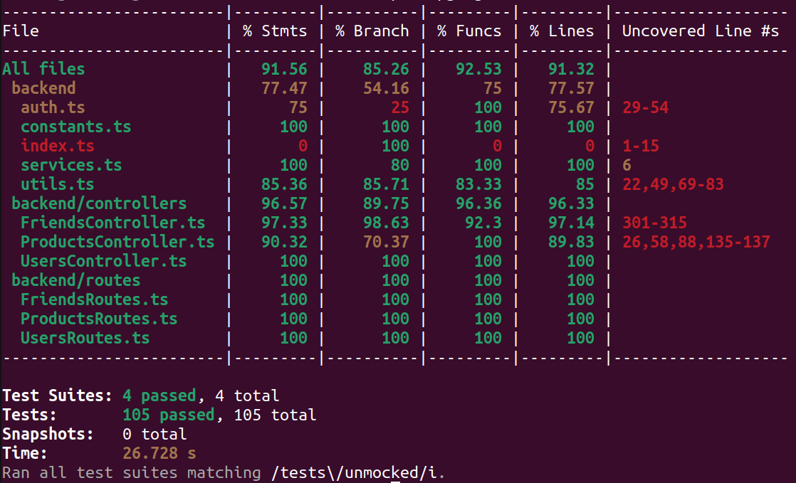

# M5: Testing and Code Review

## 1. Change History

| **Change Date** | **Modified Sections** | **Rationale** |
| -------------- | --------------------- | ------------- |
| _Nothing to show_ |

---

## 2. Back-end Test Specification: APIs

### 2.1. Locations of Back-end Tests and Instructions to Run Them

#### 2.1.1. Tests

| **Interface**                                   | **Describe Group Location, No Mocks**                 | **Describe Group Location, With Mocks**            | **Mocked Components**                                 |
| ---------------------------------------------- | ----------------------------------------------------- | ------------------------------------------------- | ------------------------------------------------------  |
| **POST /users/history**                        | [`tests/unmocked/users.test.ts#L1`](#)                | [`tests/mocked/users.test.ts#L1`](#)               | Users Database                                         |
| **GET /users/history**                         | [`tests/unmocked/users.test.ts#L1`](#)                | [`tests/mocked/users.test.ts#L1`](#)               | Users Database                                         |
| **DELETE /users/history**                      | [`tests/unmocked/users.test.ts#L1`](#)                | [`tests/mocked/users.test.ts#L1`](#)               | Users Database                                         |
| **GET /users/uuid**                            | [`tests/unmocked/users.test.ts#L1`](#)                | [`tests/mocked/users.test.ts#L1`](#)               | Users Database                                         |
| **GET /users/ecoscore_score**                  | [`tests/unmocked/users.test.ts#L1`](#)                | [`tests/mocked/users.test.ts#L1`](#)               | Users Database                                         |
| **POST /users/fcm_registration_token**         | [`tests/unmocked/users.test.ts#L1`](#)                | [`tests/mocked/users.test.ts#L1`](#)               | Users Database                                         |
| **POST /friends/requests**                     | [`tests/unmocked/friends.test.ts#L1`](#)              | [`tests/mocked/friends.test.ts#L1`](#)             | Users Database, Firebase Cloud Messaging               |
| **POST /friends/requests/accept**              | [`tests/unmocked/friends.test.ts#L1`](#)              | [`tests/mocked/friends.test.ts#L1`](#)             | Users Database, Firebase Cloud Messaging               |
| **DELETE /friends**                            | [`tests/unmocked/friends.test.ts#L1`](#)              | [`tests/mocked/friends.test.ts#L1`](#)             | Users Database                                         |
| **DELETE /friends/requests**                   | [`tests/unmocked/friends.test.ts#L1`](#)              | [`tests/mocked/friends.test.ts#L1`](#)             | Users Database                                         |
| **GET /friends/requests**                      | [`tests/unmocked/friends.test.ts#L1`](#)              | [`tests/mocked/friends.test.ts#L1`](#)             | Users Database                                         |
| **GET /friends/requests/outgoing**             | [`tests/unmocked/friends.test.ts#L1`](#)              | [`tests/mocked/friends.test.ts#L1`](#)             | Users Database                                         |
| **GET /friends**                               | [`tests/unmocked/friends.test.ts#L1`](#)              | [`tests/mocked/friends.test.ts#L1`](#)             | Users Database                                         |
| **POST /friends/notifications**                | [`tests/unmocked/friends.test.ts#L1`](#)              | [`tests/mocked/friends.test.ts#L1`](#)             | Users Database, Firebase Cloud Messaging               |
| **GET /friends/ecoscore_score/:user_uuid**     | [`tests/unmocked/friends.test.ts#L1`](#)              | [`tests/mocked/friends.test.ts#L1`](#)             | Users Database                                         |
| **GET /friends/history/:user_uuid**            | [`tests/unmocked/friends.test.ts#L1`](#)              | [`tests/mocked/friends.test.ts#L1`](#)             | Users Database                                         |
| **GET /products/:product_id**                  | [`tests/unmocked/products.test.ts#L6`](#)             | [`tests/mocked/products.test.ts#L12`](#)            | Product Database, OpenFoodFacts API                    |
| **POST /auth/google**                          | [`backend/tests/unmocked/auth.test.ts#L6`](#)         | [`backend/tests/mocked/auth.test.ts#L9`](#)        | Users Database, Google OAuth                           |

#### 2.1.2. Commit Hash Where Tests Run

`[Insert Commit SHA here]`

#### 2.1.3. Explanation on How to Run the Tests

1. **Clone the Repository**:

   - Open your terminal and run:
     ```
     git clone https://github.com/ethschan/cpen321-JELX.git
     ```

    - Navigate to the backend directory:
      ```
      cd backend
      ```

   - Install dependencies:
     ```
     npm install
     ```

2. **Set Up and Build MongoDB Container**:

   - Start and build the MongoDB container with Docker Compose:
     ```
     docker-compose up -d --build mongo
     ```

3. **Download and Restore OpenFoodFacts API Database**:

   - Download the MongoDB dump:
     ```
     wget https://cpen321-jelx.s3.us-west-2.amazonaws.com/products_db.archive
     ```

   - Copy the MongoDB dump to the Docker container:
     ```
     docker cp products_db.archive mongo_instance:/products_db.archive
     ```

   - Restore the OpenFoodFacts database in the MongoDB container:
     ```
     docker exec -it mongo_instance mongorestore --db products_db --archive=./products_db.archive --gzip --drop
     ```

4. **Run the Tests**:

    - Run the tests with mocks:
      ```
      npm run test:mocked
      ```

   - Run the tests without mocks:
     ```
     npm run test:unmocked
     ```

   - Run non-functional tests:
     ```
     npm run test:non-functional
     ```

   - Run all the tests:
     ```
     npm test
     ```

5. **Pull Down MongoDB Container**:

   - Stop the MongoDB container:
     ```
     docker-compose down
     ```

   - Remove the MongoDB container (optional, to free up disk space):
     ```
     docker rm mongo_instance
     ```

### 2.2. GitHub Actions Configuration Location

`~/.github/workflows/deploy-and-test.yml`

### 2.3. Jest Coverage Report Screenshots With Mocks


### 2.4. Jest Coverage Report Screenshots Without Mocks



---

## 3. Back-end Test Specification: Tests of Non-Functional Requirements

### 3.1. Test Locations in Git

| **Non-Functional Requirement**         | **Location in Git**                                      |
| -------------------------------------- | -------------------------------------------------------- |
| **Product Database Size**              | [`tests/non-functional/product_database_size.test.ts`](#) |
| **Product Information Response Time**  | [`tests/non-functional/product_information_response_time.test.ts`](#) |

### 3.2. Test Verification and Logs

- **Product Database Size**

  - **Verification:** This test ensures that the database contains at least 100,000 distinct products. It connects to the product database and counts the number of products with required fields such as product name, categories, and countries. The test passes if the count meets or exceeds the minimum requirement of 100,000 products.
  - **Log Output**
    ```
    PASS  tests/non-functional/product_database_size.test.ts (24.08 s)
    ● Console

      console.info
        Starting test for product database size...

        at tests/non-functional/product_database_size.test.ts:21:17

      console.info
        Product count (clipped at 100000): 100000

        at tests/non-functional/product_database_size.test.ts:32:17

      console.info
        Non-Functional Test: Product database size is sufficient.

        at tests/non-functional/product_database_size.test.ts:34:17
    ```

- **Product Information Response Time**

  - **Verification:** This test measures the time taken to retrieve product information, ensuring it is under 5 seconds. It uses performance monitoring to track the response time for fetching details of a valid product ID. The test passes if the response time is within the acceptable time limit of 5000 ms.
  - **Log Output**
    ```
    PASS  tests/non-functional/product_information_response_time.test.ts
    ● Console

      console.info
        Starting test for product response time...

        at tests/non-functional/product_information_response_time.test.ts:24:17

      console.info
        Response time: 4146.11356099695 ms

        at tests/non-functional/product_information_response_time.test.ts:30:17

      console.info
        Response status: 200

        at tests/non-functional/product_information_response_time.test.ts:31:17

      console.info
        Non-Functional Test: Product response time is under 5 seconds and product is returned.

        at tests/non-functional/product_information_response_time.test.ts:37:17
    ```

---

## 4. Front-end Test Specification

### 4.1. Location in Git of Front-end Test Suite:

`frontend/app/src/androidTest/java/com/example/carbonwise`

### 4.2. Tests

- **Use Case: Authenticate Guest User**

  - **Expected Behaviors:**
    | **Scenario Steps**                                                                 | **Test Case Steps**                                                                                                                |
    |-------------------------------------------------------------------------------------|-------------------------------------------------------------------------------------------------------------------------------------|
    | Guest user navigates to the login tab.                                              | `navigateToLoginFragment()` is called to programmatically open the login screen.                                                  |
    | The system prompts the guest with the Google OAuth authentication screen.          | `device.findObject(...id/loginButton)` is checked and clicked to launch Google Sign-In.                                           |
    | Guest user selects a Google account and grants access.                             | `handleGoogleSignIn()` automates account selection and permission granting via UIAutomator.                                       |
    | The system verifies authentication with Google OAuth.                              | Implicitly verified by successful flow to next screen.                                                                             |
    | The guest is logged in and transitioned to a user with full access.                | Verified by successful sign-in flow completion.                                                                                    |
    | **Failure 2a:** Google OAuth service error.                                         | Simulated by disabling Wi-Fi (`svc wifi disable`) and verifying toast message: "No internet connection".                          |
    | **Failure 3a:** Guest user declines to continue with Google OAuth.                 | Not explicitly tested but would result in returning to the login tab.                                                              |
    | **Failure 4a:** Google OAuth token is invalid/expired.                              | Omitted due to reliance on backend failure.                                                    |
    | **Failure 4b:** Server error when transitioning guest to full user.                | Not explicitly tested but would result in returning to the login tab.                                 

  - **Test Logs:**
      ```
      > Task :app:compileDebugAndroidTestJavaWithJavac UP-TO-DATE
      > Task :app:processDebugAndroidTestJavaRes UP-TO-DATE
      > Task :app:mergeDebugAndroidTestJavaResource UP-TO-DATE
      > Task :app:dexBuilderDebugAndroidTest
      > Task :app:mergeProjectDexDebugAndroidTest
      > Task :app:packageDebugAndroidTest
      > Task :app:createDebugAndroidTestApkListingFileRedirect UP-TO-DATE

      > Task :app:connectedDebugAndroidTest
      Starting 2 tests on Pixel_9_API_31(AVD) - 12
      Connected to process 10339 on device 'Pixel_9_API_31 [emulator-5554]'.

      Pixel_9_API_31(AVD) - 12 Tests 0/2 completed. (0 skipped) (0 failed)
      Pixel_9_API_31(AVD) - 12 Tests 1/2 completed. (0 skipped) (0 failed)
      Finished 2 tests on Pixel_9_API_31(AVD) - 12

      BUILD SUCCESSFUL in 51s
      71 actionable tasks: 5 executed, 66 up-to-date

      Build Analyzer results available
      ```

- **Use Case: Manage Product History**

  - **Expected Behaviors:**

    | **Scenario Steps**                                                                 | **Test Case Steps**                                                                                                                |
    |-------------------------------------------------------------------------------------|-------------------------------------------------------------------------------------------------------------------------------------|
    | User navigates to the history tab.                                                 | `navigateToHistoryFragment()` is called to open the history screen.                                                               |
    | User presses the delete button for a product.                                      | `pressDeleteButton()` is called, which clicks delete and confirms the action.                                                     |
    | System removes the selected product from history.                                  | Implicitly verified by successful flow with no error.                                                                              |
    | **Failure 5a:** Product does not exist in history.                                  | Omitted due to reliance on backend failure.                                                                                                      |
    | **Failure 5b:** Server error prevents deletion.                                     | Omitted due to reliance on backend failure.                                                                                                     |

    | **Scenario Steps (Friend History)**                                                 | **Test Case Steps**                                                                                                                |
    |-------------------------------------------------------------------------------------|-------------------------------------------------------------------------------------------------------------------------------------|
    | User navigates to the friends tab.                                                 | `navigateToFriendsFragment()` opens the friends screen.                                                                            |
    | User selects a friend from the friends list.                                       | `pressFirstFriendItem()` selects the first friend.                                                                                 |
    | System fetches and displays the friend’s product history.                          | `checkFriendHistoryAppears()` asserts friend history items exist.                                                                  |
    | **Failure 3a:** Server error when fetching history.                                 | Simulated with Wi-Fi off in `testViewFriendHistoryConnectionError()` and toast log check.                                          |
    | **Failure 3b:** Friend is no longer a friend.                                       | Omitted due to reliance on backend failure.                                                                                                  |

  - **Test Logs:**
      ```
      > Task :app:compileDebugAndroidTestJavaWithJavac UP-TO-DATE
      > Task :app:processDebugAndroidTestJavaRes UP-TO-DATE
      > Task :app:mergeDebugAndroidTestJavaResource UP-TO-DATE
      > Task :app:dexBuilderDebugAndroidTest
      > Task :app:mergeProjectDexDebugAndroidTest
      > Task :app:packageDebugAndroidTest
      > Task :app:createDebugAndroidTestApkListingFileRedirect UP-TO-DATE

      > Task :app:connectedDebugAndroidTest
      Starting 4 tests on Pixel_9_API_31(AVD) - 12
      Connected to process 12788 on device 'Pixel_9_API_31 [emulator-5554]'.

      Pixel_9_API_31(AVD) - 12 Tests 0/4 completed. (0 skipped) (0 failed)
      Pixel_9_API_31(AVD) - 12 Tests 1/4 completed. (0 skipped) (0 failed)
      Pixel_9_API_31(AVD) - 12 Tests 2/4 completed. (0 skipped) (0 failed)
      Pixel_9_API_31(AVD) - 12 Tests 3/4 completed. (0 skipped) (0 failed)
      Finished 4 tests on Pixel_9_API_31(AVD) - 12

      BUILD SUCCESSFUL in 3m 14s
      71 actionable tasks: 5 executed, 66 up-to-date

      Build Analyzer results available
      ```

## 5. Automated Code Review Results

### 5.1. Commit Hash Where Codacy Ran

`[Insert Commit SHA here]`

### 5.2. Unfixed Issues per Codacy Category

_(Placeholder for screenshots of Codacy’s Category Breakdown table in Overview)_

### 5.3. Unfixed Issues per Codacy Code Pattern

_(Placeholder for screenshots of Codacy’s Issues page)_

### 5.4. Justifications for Unfixed Issues

- **Code Pattern: [Usage of Deprecated Modules](#)**

  1. **Issue**

     - **Location in Git:** [`src/services/chatService.js#L31`](#)
     - **Justification:** ...

  2. ...

- ...